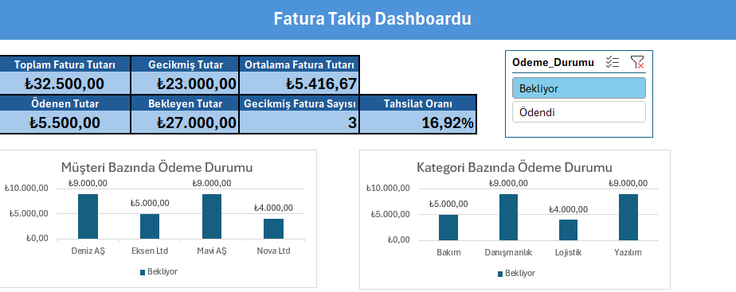

# Excel Fatura Takip Dashboardu

## Proje Hakkında
Bu projede Excel kullanılarak faturaların ödeme ve vade durumlarını takip eden interaktif bir dashboard hazırlanmıştır.

## Kullanılan Özellikler
- PivotTable ve PivotChart
- KPI kartları
- IF, SUMIFS ve COUNTIFS formülleri
- VLOOKUP ile veri eşleştirme
- TODAY ile vade kontrolü
- Koşullu biçimlendirme
- Slicer ile dinamik filtreleme

## Dashboard Görünümü

## Proje Dosyası
[Excel dosyasını indir](Fatura_Takip_Dashboard.xlsx)
