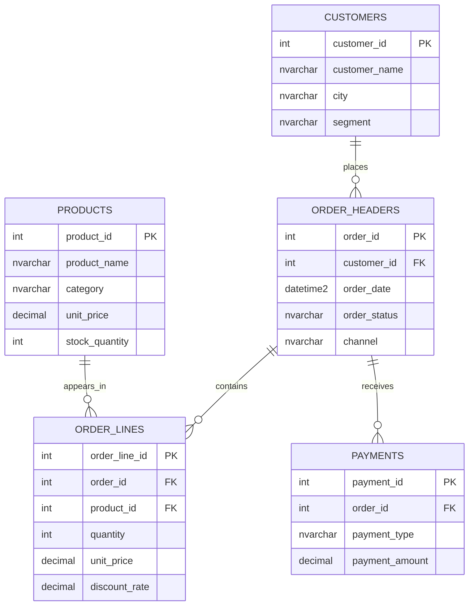

# SQL Server İş Operasyonları Portföyü

Bu proje, kurgusal bir B2B e-ticaret işletmesinin müşteri, ürün, sipariş, ödeme ve stok verileri üzerinde hazırlanmış SQL Server çalışmasıdır.

Amaç yalnızca SQL komutlarını göstermek değil; iş sorularını doğru tablo ve kolonlarla analiz etmek, veri tutarsızlıklarını bulmak ve tekrar kullanılabilir raporlama yapıları oluşturmaktır.

## İş Senaryosu

İşletme aşağıdaki sorulara cevap aramaktadır:

- Hangi şehirler ve ürün kategorileri daha fazla gelir üretiyor?
- Ödeme kaydı olmayan veya tutarı satış toplamıyla uyuşmayan siparişler var mı?
- Her kategoride en çok gelir getiren ürün hangisi?
- Günlük gelir zaman içinde nasıl birikiyor?
- Sipariş ve müşteri verilerinde eksik veya tekrar eden kayıtlar var mı?
- ERP ile B2B stok ve fiyat kayıtları arasında fark bulunuyor mu?

## Veri Modeli

## Dosyalar

| Dosya | İçerik |
|---|---|
| `00_Setup.sql` | Şema, tablolar ve kurgusal örnek veriler |
| `01_Basic_Querying.sql` | SELECT, WHERE, DISTINCT, TOP, LIKE, IN, BETWEEN, NULL, tarih ve metin fonksiyonları |
| `02_Joins_and_Aggregations.sql` | JOIN türleri, COUNT, SUM, AVG, GROUP BY, HAVING ve veri kalite kontrolleri |
| `03_Subqueries_CTE_Window_Functions.sql` | Subquery, EXISTS, derived table, CTE, ROW_NUMBER, RANK ve kümülatif toplam |
| `04_DML_and_Transactions.sql` | INSERT, UPDATE, DELETE, INSERT SELECT ve transaction güvenliği |
| `05_Stored_Procedures.sql` | Parametreli rapor prosedürleri ve hata kontrollü güncelleme örneği |
| `06_Temp_Table_View_Index.sql` | Geçici tablo, VIEW ve indeks kullanımı |
| `07_Cursor_vs_Set_Based.sql` | Cursor ile set-based yaklaşımın karşılaştırılması |
| `08_ERP_B2B_Reconciliation.sql` | ERP ve B2B stok/fiyat kayıtlarının karşılaştırılması |

## Kullanılan SQL Konuları

- SELECT, WHERE, ORDER BY, DISTINCT ve TOP
- LIKE, IN, BETWEEN ve NULL kontrolleri
- INNER JOIN, LEFT JOIN ve FULL OUTER JOIN
- COUNT, SUM, AVG, MIN, MAX, GROUP BY ve HAVING
- Subquery, EXISTS, NOT EXISTS ve derived table
- CTE ve window functions
- CASE WHEN ile iş etiketi oluşturma
- GETDATE, DATEADD, DATEDIFF, YEAR ve MONTH
- INSERT, UPDATE, DELETE ve transaction
- Stored procedure ve parametre kullanımı
- Temporary table, VIEW ve INDEX
- Cursor ve set-based işlem karşılaştırması
- ERP/B2B veri doğrulama ve mutabakat kontrolleri

## Çalıştırma Sırası

1. SQL Server üzerinde boş bir veritabanı oluşturun ve o veritabanını seçin.
2. Önce `00_Setup.sql` dosyasını çalıştırın.
3. Diğer dosyaları numara sırasına göre çalıştırın.

`00_Setup.sql` yalnızca bu projeye ait `portfolio` şemasındaki nesneleri yeniden oluşturur. DML dosyasındaki kalıcı veri değiştiren örnekler güvenlik amacıyla transaction içinde geri alınır veya çalıştırma satırı yorumda bırakılır.

## Projenin Özgünlüğü

Bu depodaki veri modeli, iş soruları ve SQL kodları portföy amacıyla sıfırdan hazırlanmıştır. Herhangi bir işverenin sınav metni, özel dokümanı veya gerçek şirket verisi paylaşılmamıştır.

